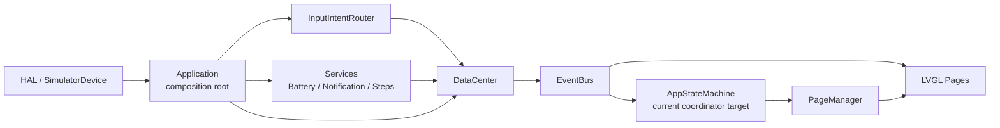

# Magic Watch Current Architecture

日期：2026-05-26

## 当前主线



## 值得保护的边界

- `InputIntentRouter`: 原始输入到应用意图。
- `Service`: 平台样本到应用模型。
- `DataCenter + EventBus`: v0 共享模型入口和事件分发。
- `AppStateMachine`: 系统级协调者，未来应逐步退回 Coordinator。
- `PageManager`: 页面显示、页面栈、临时壳层。
- `Pages`: LVGL UI、页面局部状态和控件生命周期。

## 当前风险

- `AppStateMachine` 同时处理输入、电源、主页环、壳层、通知唤醒和计时器，存在 God Class 风险。
- `ShellPages.cpp` 与 `SettingsPages.cpp` 文件过大，但不能先机械拆分，否则容易复制生命周期问题。
- `DataCenter` 继续增加字段会形成超级对象风险。
- `EventBus` 当前是同步分发，未来接 RTOS 或真实硬件时需要重新定义队列、快照或同步边界。

## 架构收口路线

```text
第 0 轮：文档止血
第 1A 轮：AppStateMachine 状态与事件盘点
第 1B 轮：提取 PowerController
第 1C 轮：继续逐个提取 Controller
第 2A 轮：UI 生命周期契约 / 最小生命周期基座
第 2B 轮：拆 SettingsPages.cpp
第 3 轮：拆 ShellPages.cpp
第 4 轮：硬件边界设计
```

## Scope Lock 模板

每轮开始前必须写明：

```text
Allowed files:
- 本轮允许新增或修改的文件

Forbidden files:
- 本轮禁止修改的文件

Forbidden changes:
- 本轮禁止行为
```

通用禁止项：

- 禁止顺手重构非本轮目标模块。
- 禁止批量格式化无关文件。
- 禁止重命名公共 API，除非本轮明确要求。
- 禁止改变 `InputIntentRouter`、`PageManager`、现有 `Event` 枚举语义。
- 禁止同时拆多个领域。
- 禁止删除大文件或目录。
- 禁止把页面 UI 逻辑塞进 Controller。
- 禁止 Controller 直接调用 `PageManager`、创建 LVGL 对象或访问页面内部。
- 禁止在 Action/Event 中引入 `std::string`、`std::vector`、heap allocation 或复杂对象所有权。

每轮结束后必须检查 `git status`，报告实际修改文件，并说明是否出现越权修改。

## 第 1A 轮输出要求

`docs/10_architecture/state_machine.md` 必须作为第 1B 轮代码边界输入，至少包含：

- `AppStateMachine` 状态变量归属表。
- `EventBus` 事件处理路径表。
- 所有 `PageManager` 调用点表。
- `PowerController` 候选迁移状态清单。
- `PowerController` 候选迁移函数清单。
- 暂留 `AppStateMachine` 的状态及原因。
- 下一轮应移动到 Controller 私有成员的状态。
- 并发风险/高频共享状态标注。

状态表字段固定为：

```text
状态变量 | 当前用途 | 应归属领域 | 修改者 | 读取者 | 是否应继续留在 AppStateMachine | 并发风险/高频共享 | 未来同步策略
```

## PowerController 约束

`PowerController` 应真正拥有电源相关状态，负责电源策略判断，但不直接操作 UI、`PageManager` 或页面内部。

`PowerAction` 必须固定大小、可按值传递、无动态资源。建议形态：

```cpp
enum class PowerActionType : uint8_t {
    None,
    WakeScreen,
    TurnScreenOff,
    EnterLowPowerMode,
    ExitLowPowerMode,
    ShowPowerMenu,
};

enum class PowerActionReason : uint8_t {
    UserInput,
    Timeout,
    BatteryLow,
    UserRequest,
    NotificationWake,
};

struct PowerAction {
    PowerActionType type{PowerActionType::None};
    PowerActionReason reason{PowerActionReason::UserInput};
    int8_t target_brightness_percent{-1};
    int32_t next_wakeup_ms{-1};
    bool pause_background_polling{false};
    bool restore_previous_page{false};
};
```

`AppStateMachine` 应统一应用 `PowerAction` 并处理跨域冲突，不得为执行 Action 反向读取 Controller 内部 mutable state。

## UI 生命周期约束

拆 `SettingsPages.cpp` 和 `ShellPages.cpp` 前，必须先完成 UI 生命周期契约：

- LVGL root object 谁创建、谁销毁。
- 页面 destroy 是否调用 `lv_obj_del`。
- LVGL timer 谁创建、谁释放。
- EventBus 订阅谁取消。
- 临时壳层是否常驻。
- 页面状态属于页面内部、`DataCenter`，还是 `AppStateMachine`。

LVGL 对象树拥有最终释放权。C++ wrapper 不得盲目在析构函数中对所有 `lv_obj_t*` 调用 `lv_obj_del`，避免 C++ RAII 与 LVGL 对象树双重释放。保存 `lv_obj_t*` 默认视为弱引用或受控引用，应通过 `LV_EVENT_DELETE` 将已删除指针置空或标记 invalid。

优先轻量 helper，例如 `LvglDeleteAwarePtr`、`LvglTimerGuard`、`EventSubscriptionGuard`、`PageLifecycle helper`。不急着重写整个 UI 框架。

## 并发与硬件预留

从第 1A 轮开始标注并发风险，第 4 轮再正式设计硬件同步边界：

- ISR 不直接改 UI。
- 硬件采样通过队列或 service 进入应用层。
- `DataCenter` 不暴露可变裸引用。
- 高频数据不直接触发大量同步 UI 更新。
- Controller 读取快照或消费事件，不共享可变状态。
- `Driver/BSP/HAL` 与 `UI/StateMachine` 之间必须有事件队列、快照或同步边界。
