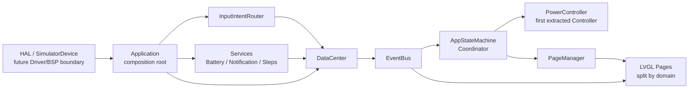

# Magic Watch Current Architecture

日期：2026-06-04

## 当前主线

阶段 8 已完成架构收口与手动 UI 回归闭环。当前主线推进到阶段 9：真实硬件桥接。阶段 9 不以 PC trace replay / log replay 作为硬件闭环验收，而以 T-Watch S3 Plus 真机上交叉编译并运行 Magic Watch 最小架构子集为第一证明点。


```mermaid
flowchart LR
    HAL["HAL / SimulatorDevice\nfuture Driver/BSP boundary"]
    App["Application\ncomposition root"]
    Router["InputIntentRouter"]
    Services["Services\nBattery / Notification / Steps"]
    DataCenter["DataCenter"]
    EventBus["EventBus"]
    StateMachine["AppStateMachine\nCoordinator"]
    PowerController["PowerController\nfirst extracted Controller"]
    PageManager["PageManager"]
    Pages["LVGL Pages\nsplit by domain"]

    HAL --> App
    App --> Router
    App --> Services
    Router --> DataCenter
    Services --> DataCenter
    App --> DataCenter
    DataCenter --> EventBus
    EventBus --> StateMachine
    EventBus --> Pages
    StateMachine --> PowerController
    StateMachine --> PageManager
    PageManager --> Pages
```

## 值得保护的边界

- `InputIntentRouter`: 原始输入到应用意图。
- `Service`: 平台样本到应用模型。
- `DataCenter + EventBus`: v0 共享模型入口和事件分发。
- `AppStateMachine`: 系统级协调者，未来应逐步退回 Coordinator。
- `PowerController`: 第一个已落地子 Controller，只返回固定大小 Action，不直接操作 UI 或 `PageManager`。
- `PageManager`: 页面显示、页面栈、临时壳层。
- `Pages`: LVGL UI、页面局部状态和控件生命周期；页面实现已经按领域显著下沉。

## 当前风险

- `AppStateMachine` 同时处理输入、电源、主页环、壳层、通知唤醒和计时器，存在 God Class 风险。
- `ShellPages.cpp` 已从构建退场；`ShellPages.h` 已收口为过渡兼容 include 头，当前风险转向 `Application.cpp` 剩余注册尾巴与手动 UI 回归。
- `SettingsPages.cpp` / `SettingsPages.h` 仍需后续单独审计，不能和 Shell 收口混在一轮处理。
- `DataCenter` 继续增加字段会形成超级对象风险。
- `EventBus` 当前是同步分发，未来接 RTOS 或真实硬件时需要重新定义队列、快照或同步边界。
- UI 生命周期契约已建立，`LvglTimerGuard` 已存在；裸 `lv_timer_t*` 仍需逐页小步迁移。
- 阶段 9 已开始真实硬件桥接，PC replay 只能作为辅助测试；硬件闭环必须在真实 MCU 上运行最小架构子集。
- `EventBus` 当前同步分发不能原样作为 RTOS 多任务边界证明；阶段 9 第一轮应使用简化板载子集，并记录 `free_heap` 与 task high water mark。

## 阶段 8 验收地图

| 最初目标 | 当前判断 | 证据 / 现状 | 下一步收口 |
| --- | --- | --- | --- |
| 新会话快速理解项目 | 基本达成 | `document_map.md` 已作为任务路由器，`00_current/` 承担当前入口；长历史文档不再默认读 | 继续保持入口短，避免旧事实回流 |
| 页面实现不再回流巨石 | 已达成 | `ShellPages.cpp` 已退场，Shell/Home/Notifications/QuickSettings/Launcher/Power/Daily/Health 实现已分域下沉，`ShellPages.h` 已收口为兼容 include 头 | 保持当前边界，不让新页面回流 |
| 新增功能最小化修改 | 部分达成 | 页面实现文件已分域；`Application.cpp` 已完成 Home、Notifications、QuickSettings、Power、Daily、Health 注册分流，剩余尾巴集中在 Launcher 与 Settings | 当前接受 Launcher 直接注册与 Settings 长列表的阶段性偏离，后续如需继续收口再单独拆轮 |
| Controller 可复用且不操作 UI | 部分达成 | `PowerController` 已落地；其它 Controller 仍未提取 | 继续按状态归属逐个提取，不盲目新增 |
| UI 生命周期清楚 | 部分达成 | `ui_lifecycle.md` 已定义契约，`LvglTimerGuard` 已存在，并已落到 Steps、Launcher、Notifications、QuickSettings、Sleep、BloodOxygen、HeartRate 的一部分 timer | 继续迁移复杂裸 timer，优先处理高风险剩余项 |
| 未来硬件接入不重写上层 | 部分达成 | `hardware_boundary.md` 已定义上层职责边界；当前硬件选型未定，仍主要依赖模拟器路径 | 保持契约稳定，待后续硬件阶段落地实现 |
| 构建通过不等于行为通过 | 已达成本阶段收口 | 阶段 8 手动 UI 回归已实际执行并通过；构建通过与行为通过已被明确区分 | 后续新改动仍按回归包或完整矩阵继续验证 |

补充说明：

- 真实硬件接入的上层职责边界已定义在 `docs/10_architecture/hardware_boundary.md`。
- 当前仍未绑定芯片、板卡或 RTOS；后续实现只能在该契约内补充具体同步机制。
- 当前接受两处 8C 尾巴：
  - `LauncherPage` 继续直接注册，原因是它只剩单页入口，继续抽独立注册函数的收益有限。
  - Settings 继续保留注册长列表，原因是它仍与 `SettingsPages.h` 聚合入口绑定，更适合留到后续 Settings 专项审计阶段再处理。

## 阶段 8 架构收口路线

```text
8A：文档入口与当前架构验收地图（已完成）
8B：ShellPages.h 聚合头按领域拆分（已完成）
8C：Application.cpp 页面注册按领域分流（已基本完成；当前接受 Launcher / Settings 尾巴为阶段性偏离）
8D：UI 生命周期落地到已有 LvglTimerGuard（已进入逐页落地阶段，仍有复杂 timer 待继续）
8E：硬件接入边界文档契约（已完成）
8F：手动 UI 回归闭环（已执行并通过）
```

## 阶段 9 真实硬件桥接路线

```text
9A：阶段 9 文档入口与硬规则落档（当前轮）
9B：T-Watch S3 Plus AXP2101 -> BatteryPowerStatus 底层读数闭环
9C：hal::BatterySample / BatteryPowerService / DataCenter / simplified EventBus 最小子集下放
9D：真实 FreeRTOS Power_Task + BatteryChanged 串口观测
9E：记录可复用上层代码与暂不能下放的边界
```

阶段 9 第一条垂直切片只覆盖 Battery / PowerStatus，不接完整 UI、不接高频传感器、不绑定最终硬件选型。

PC trace replay / log replay 可以作为辅助对照，但不能替代 T-Watch S3 Plus 真机上的交叉编译、运行、`free_heap` 与 task high water mark 观测。

## Scope Lock 模板

每轮开始前必须写明：

```text
Allowed files:
- 本轮允许新增或修改的文件

Forbidden files:
- 本轮禁止修改的文件

Forbidden changes:
- 本轮禁止行为
```

通用禁止项：

- 禁止顺手重构非本轮目标模块。
- 禁止批量格式化无关文件。
- 禁止重命名公共 API，除非本轮明确要求。
- 禁止改变 `InputIntentRouter`、`PageManager`、现有 `Event` 枚举语义。
- 禁止同时拆多个领域。
- 禁止删除大文件或目录。
- 禁止把页面 UI 逻辑塞进 Controller。
- 禁止 Controller 直接调用 `PageManager`、创建 LVGL 对象或访问页面内部。
- 禁止在 Action/Event 中引入 `std::string`、`std::vector`、heap allocation 或复杂对象所有权。

每轮结束后必须检查 `git status`，报告实际修改文件，并说明是否出现越权修改。

## 第 1A 轮输出要求

`docs/10_architecture/state_machine.md` 必须作为第 1B 轮代码边界输入，至少包含：

- `AppStateMachine` 状态变量归属表。
- `EventBus` 事件处理路径表。
- 所有 `PageManager` 调用点表。
- `PowerController` 候选迁移状态清单。
- `PowerController` 候选迁移函数清单。
- 暂留 `AppStateMachine` 的状态及原因。
- 下一轮应移动到 Controller 私有成员的状态。
- 并发风险/高频共享状态标注。

状态表字段固定为：

```text
状态变量 | 当前用途 | 应归属领域 | 修改者 | 读取者 | 是否应继续留在 AppStateMachine | 并发风险/高频共享 | 未来同步策略
```

## PowerController 约束

`PowerController` 应真正拥有电源相关状态，负责电源策略判断，但不直接操作 UI、`PageManager` 或页面内部。

`PowerAction` 必须固定大小、可按值传递、无动态资源。建议形态：

```cpp
enum class PowerActionType : uint8_t {
    None,
    WakeScreen,
    TurnScreenOff,
    EnterLowPowerMode,
    ExitLowPowerMode,
    ShowPowerMenu,
};

enum class PowerActionReason : uint8_t {
    UserInput,
    Timeout,
    BatteryLow,
    UserRequest,
    NotificationWake,
};

struct PowerAction {
    PowerActionType type{PowerActionType::None};
    PowerActionReason reason{PowerActionReason::UserInput};
    int8_t target_brightness_percent{-1};
    int32_t next_wakeup_ms{-1};
    bool pause_background_polling{false};
    bool restore_previous_page{false};
};
```

`AppStateMachine` 应统一应用 `PowerAction` 并处理跨域冲突，不得为执行 Action 反向读取 Controller 内部 mutable state。

## UI 生命周期约束

拆分页面实现、聚合头或注册结构前，必须遵守 UI 生命周期契约：

- LVGL root object 谁创建、谁销毁。
- 页面 destroy 是否调用 `lv_obj_del`。
- LVGL timer 谁创建、谁释放。
- EventBus 订阅谁取消。
- 临时壳层是否常驻。
- 页面状态属于页面内部、`DataCenter`，还是 `AppStateMachine`。

LVGL 对象树拥有最终释放权。C++ wrapper 不得盲目在析构函数中对所有 `lv_obj_t*` 调用 `lv_obj_del`，避免 C++ RAII 与 LVGL 对象树双重释放。保存 `lv_obj_t*` 默认视为弱引用或受控引用，应通过 `LV_EVENT_DELETE` 将已删除指针置空或标记 invalid。

`LvglTimerGuard` 已存在，后续应优先把低风险裸 `lv_timer_t*` 逐页迁到 guard。`LvglDeleteAwarePtr`、`EventSubscriptionGuard`、`PageLifecycle helper` 仍是候选，不急着重写整个 UI 框架。

## 并发与硬件预留

从第 1A 轮开始标注并发风险，第 4 轮再正式设计硬件同步边界：

- ISR 不直接改 UI。
- 硬件采样通过队列或 service 进入应用层。
- `DataCenter` 不暴露可变裸引用。
- 高频数据不直接触发大量同步 UI 更新。
- Controller 读取快照或消费事件，不共享可变状态。
- `Driver/BSP/HAL` 与 `UI/StateMachine` 之间必须有事件队列、快照或同步边界。
