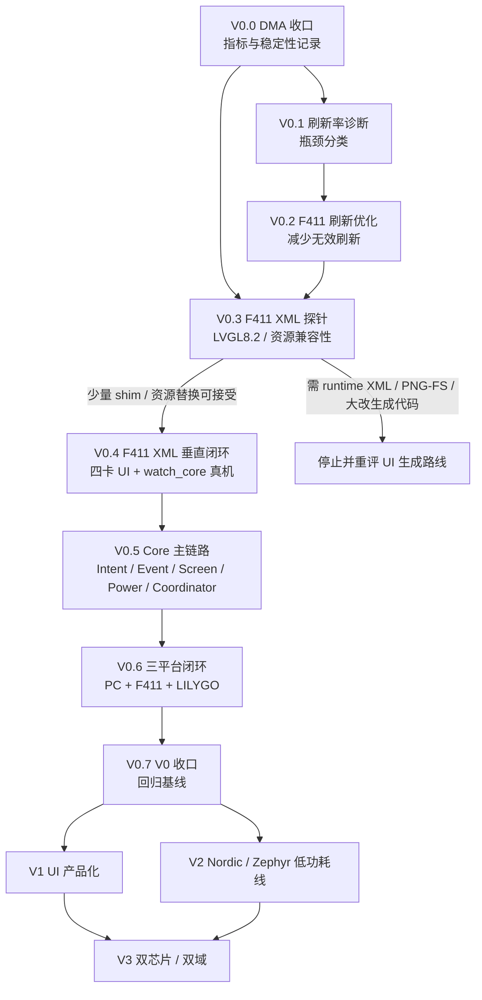

# MagicWatch V0-V3 执行路线图

> 状态：Current Draft  
> 更新日期：2026-06-07  
> 路由类型：按需当前计划  
> 适用场景：规划 V0-V3、拆分执行卡、判断当前阶段是否该继续或停止

---

## 1. 一句话结论

MagicWatch 当前继续沿 `LVGL XML + watch_core + PC/F411 双后端` 推进。

V0 的短期目标不是追 60fps，也不是继续堆页面，而是把输入、事件、页面、电源、平台端口和显示链路做成可解释、可迁移、可回归的三平台闭环。

核心判断：

- F411 是资源约束训练场，不是最终产品性能目标。
- V0 优先稳定、可解释、可迁移。
- XML 是 UI 源，固件吃生成 C。
- DMA 已接通，但后续不再把 DMA 当主优化方向。
- F411 接 XML 前必须先做 LVGL 版本和资源兼容性探针。

---

## 2. 当前事实

- PC 新主线 `magic_watch_xml_sim` 已完成健康四卡显示、点击详情、Back 返回和 `UiEvent -> Coordinator -> PageIntent -> UI Adapter` 链路验收。
- F411 已完成颜色、字体、有效 FPS 基线、SPI DMA fallback 和异步 DMA flush 接入。
- 用户真机确认 `wait_cb` 修正后 DMA flush 路径恢复正常显示。
- F411 当前 LVGL 是 `8.2.0`，PC XML 目标使用 LVGL `9.6.0-dev`。
- PC 目标允许文件路径资源，F411 当前 `LV_USE_FS_*` 和 `LV_USE_PNG` 为 0。

这些事实决定：下一步应先收口 DMA 指标，再做刷新率诊断和 F411 XML 兼容性探针，而不是继续围绕 DMA 写代码。

---

## 3. 阶段依赖图

---

## 4. V0 执行门

| 阶段 | 工程目标 | 输入条件 | 输出 | 禁止事项 | 验收标准 | 停止条件 | 成长目标 |
|---|---|---|---|---|---|---|---|
| V0.0 | DMA 小闭环结束 | DMA-2 真机正常 | DMA 前后指标表 | 禁止继续改 DMA | 指标和花屏 / 卡死记录入档 | DMA 不稳定则回到完成链路排查 | 学会停止局部优化 |
| V0.1 | 拆分刷新瓶颈 | V0.0 完成 | 绘制 / 转换 / 传输 / 调度分类 | 禁止优化和重构 | 能判断慢在哪一段 | 指标不可复现 | 学会数据化性能分析 |
| V0.2 | 减少无效刷新 | V0.1 有结论 | 刷新面积和频率下降 | 禁止追 DMA | 同场景无退化 | 需要大改 LVGL / 驱动 | 学会 MCU UI 少干活 |
| V0.3 | F411 XML 探针 | PC 四卡验收、F411 基线 | `compatibility_probe.md` | 禁止手改生成文件、升级 LVGL | 能判断继续或止损 | 需 runtime XML / PNG-FS / 大改生成代码 | 学会兼容性探针 |
| V0.4 | F411 XML 真机最小闭环 | V0.3 可继续 | 四卡 UI + core 快照上板 | 禁止平台解释业务 | F411 编译和真机显示通过 | Flash / RAM 或 API 成本超预算 | 学会 UI / bridge / core 分离 |
| V0.5 | Core 主链路 | V0.4 稳定 | Intent / Event / Screen / Power / Coordinator | 禁止一次性生成完整 core | Core 边界检查通过 | 职责说不清 | 学会状态所有权 |
| V0.6 | 三平台闭环 | V0.5 稳定 | PC / F411 / LILYGO 共用核心语义 | 禁止绑定最终芯片 | 抬腕亮屏、息屏、唤醒闭环 | platform 开始拥有业务 | 学会平台抽象 |
| V0.7 | V0 收口 | 三平台闭环完成 | 回归基线和阶段总结 | 禁止继续加功能拖延 | 能回答 V0 十个架构问题 | 新需求不影响 V0 定义 | 学会阶段验收 |

---

## 5. 初始量化门槛

| 项目 | V0 初始门槛 |
|---|---|
| F411 draw buffer | 默认 `WATCH_LVGL_DRAW_BUF_LINES <= 20`；任何调整必须记录 RAM 增量和指标变化 |
| debug overlay | 常规指标更新频率 `<= 1Hz`；FPS 负载探针必须可单独关闭 |
| 静态产品 UI 刷新 | 空闲状态不得周期性全屏刷新；常规 dirty area 目标 `<= 10%` 屏幕 / 次 |
| 调试探针刷新 | 允许临时 `<= 50%` 屏幕 / 次，但必须标注为 probe，不作为产品 UI 基线 |
| 稳定性 | 静态运行 `>= 10min` 无花屏 / 卡死；输入压力 `>= 2min` 无永久卡死 |
| Core 边界 | `watch_core` 中 `lvgl/HAL/SDL/CubeMX` include 命中数为 0 |
| 动态内存 | `watch_core` 中 `malloc/free/new/delete/STL` 命中数为 0 |
| F411 XML 资源 | PNG / FS 不是主路径；优先 C 数组或轻量 LVGL 对象资源 |

这些门槛是初始判断线，不是最终产品指标。若实际硬件证明某个门槛不合理，应先记录证据，再调整文档。

---

## 6. V0 任务卡拆分

### V0.0 DMA 收口

- `V0.0-A`：记录 DMA 前后指标，只改 README、卡片和进度文档。

### V0.1 刷新率诊断

- `V0.1-A`：定义性能指标结构，只改观测接口。
- `V0.1-B`：记录 flush 调用频率和刷新面积。
- `V0.1-C`：记录 RGB565 转换耗时。
- `V0.1-D`：记录 SPI / DMA 传输耗时。
- `V0.1-E`：输出瓶颈判断文档。

### V0.2 F411 刷新优化

- `V0.2-A`：隔离 debug FPS 负载和真实 UI 负载。
- `V0.2-B`：减少 overlay 更新频率和 invalidate 面积。
- `V0.2-C`：评估 draw buffer 行数、刷新周期和静态 UI 常刷。

### V0.3 F411 XML 探针

- `V0.3-A`：列出生成 C 的 LVGL API 清单。
- `V0.3-B`：评估 LVGL 9.6 到 8.2 的不兼容点。
- `V0.3-C`：评估图片、字体、Flash / RAM 资源成本。
- `V0.3-D`：输出继续 / 止损结论。

### V0.5 Core 主链路

- `V0.5-A`：只定义 `ScreenId`、`PowerState`、`InputIntent`。
- `V0.5-B`：只定义 `SystemEvent`。
- `V0.5-C`：实现固定环形 `EventQueue`。
- `V0.5-D`：实现最小 `ScreenManager`。
- `V0.5-E`：实现表驱动 `PowerController`。
- `V0.5-F`：实现 `Coordinator` 分发。
- `V0.5-G`：写架构边界检查文档。

V0.5 是个人能力分水岭，不允许 AI 一次性生成完整 core。

---

## 7. V1-V3 路线

| 阶段 | 目标 | 重点 |
|---|---|---|
| V1 | UI 产品化 | 表盘、快捷面板、通知、设置、健康详情、资源预算、动画预算、截图回归；LILYGO 做体验主板，F411 做约束对照 |
| V2 | Nordic / Zephyr 低功耗核心 | BLE 通知最小协议、传感器低功耗采样、功耗测量、DFU、Zephyr driver / service / power model |
| V3 | 双芯片 / 双域架构 | Display / App Core + Always-on Core、唤醒协议、时间同步、通知缓存、双日志、协议版本、双固件升级 |

---

## 8. 跨阶段复用规则

V0 稳定复用：

- `EventQueue`
- `InputIntent` 语义
- `ScreenManager` 契约
- `PowerController` API
- `UiEvent` / `PageIntent`
- platform port 边界

V1 可迭代：

- XML layout token
- 视觉资源
- 页面样式
- LILYGO 触摸体验
- 动画预算
- 服务字段

V1 不得破坏：

- Core 纯 C、固定容量、无堆
- UI 不碰 HAL
- Platform 不碰业务
- 生成文件禁止手改
- PC / F411 已验收的基础行为

V2 可替换平台实现，但不得改变 Core 事件语义。Zephyr / Nordic 只能实现 port 或 service，不能反向污染 `watch_core`。

V3 双域协议必须围绕 V0 / V1 已稳定的事件和电源语义设计，不能把双芯片复杂度提前压回 V0。

---

## 9. V0 完成定义

V0 完成时必须能回答：

1. 输入从哪里来，如何统一成 Intent？
2. 事件如何进入队列，谁消费？
3. 页面切换唯一入口在哪里？
4. PowerController 如何决定亮屏、息屏、唤醒？
5. Platform 如何执行 display、input、tick、power？
6. PC、F411、LILYGO 是否共享同一套 Core 语义？
7. 是否存在页面直接 include HAL？
8. 是否存在 Core 直接 include LVGL？
9. 是否存在 ISR 直接调用 LVGL？
10. 是否存在动态内存依赖？

这些问题全部能用代码和文档回答清楚，V0 才算真正收口。
