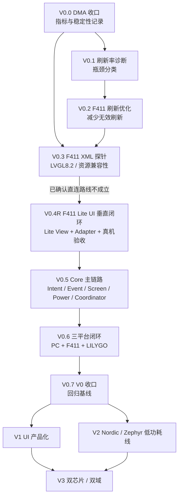

# MagicWatch V0-V3 执行路线图

> 状态：Current Draft  
> 更新日期：2026-06-13
> 路由类型：按需当前计划  
> 适用场景：规划 V0-V3、拆分执行卡、判断当前阶段是否该继续或停止

---

## 1. 一句话结论

MagicWatch 当前继续沿 `LVGL XML + watch_core + PC 验证主线` 推进；原定义 `V0.4 F411 XML 真机最小闭环` 已被 `V0.4R F411 Lite UI 垂直闭环` 替代。

V0 的短期目标不是追 60fps，也不是继续堆页面，而是把输入、事件、页面、电源、平台端口和显示链路做成可解释、可迁移、可回归的三平台闭环。

核心判断：

- F411 是资源约束训练场，不是最终产品性能目标。
- V0 优先稳定、可解释、可迁移。
- XML 是 PC UI 主线的 UI 源，不再要求 F411 吃同一份生成 C。
- DMA 已接通，但后续不再把 DMA 当主优化方向。
- F411 真机闭环固定共享语义合同，不固定 UI 技术实现。

---

## 2. 当前事实

- PC 新主线 `magic_watch_xml_sim` 已完成健康四卡显示、点击详情、Back 返回和 `UiEvent -> Coordinator -> PageIntent -> UI Adapter` 链路验收。
- F411 已完成颜色、字体、有效 FPS 基线、SPI DMA fallback 和异步 DMA flush 接入。
- 用户真机确认 `wait_cb` 修正后 DMA flush 路径恢复正常显示。
- F411 当前 LVGL 是 `8.2.0`，PC XML 目标使用 LVGL `9.6.0-dev`。
- PC 目标允许文件路径资源，F411 当前 `LV_USE_FS_*` 和 `LV_USE_PNG` 为 0。

这些事实决定：DMA 收口、刷新诊断和 F411 XML 探针完成后，不应直接进入原定义 `V0.4 F411 XML 真机最小闭环`，而应改走 `V0.4R F411 Lite UI 垂直闭环`。

---

## 3. 阶段依赖图

---

## 4. V0 执行门

| 阶段 | 工程目标 | 输入条件 | 输出 | 禁止事项 | 验收标准 | 停止条件 | 成长目标 |
|---|---|---|---|---|---|---|---|
| V0.0 | DMA 小闭环结束 | DMA-2 真机正常 | DMA 前后指标表 | 禁止继续改 DMA | 指标和花屏 / 卡死记录入档 | DMA 不稳定则回到完成链路排查 | 学会停止局部优化 |
| V0.1 | 拆分刷新瓶颈 | V0.0 完成 | 绘制 / 转换 / 传输 / 调度分类 | 禁止优化和重构 | 能判断慢在哪一段 | 指标不可复现 | 学会数据化性能分析 |
| V0.2 | 减少无效刷新 | V0.1 有结论 | 刷新面积和频率下降 | 禁止追 DMA | 同场景无退化 | 需要大改 LVGL / 驱动 | 学会 MCU UI 少干活 |
| V0.3 | F411 XML 探针 | PC 四卡验收、F411 基线 | `compatibility_probe.md` | 禁止手改生成文件、升级 LVGL | 能判断继续或止损 | 需 runtime XML / PNG-FS / 大改生成代码 | 学会兼容性探针 |
| V0.4R | F411 Lite UI 垂直闭环 | `V0.3-D` 已止损原路线并确认替代边界 | Lite View + Adapter + 四卡语义闭环上板 | 禁止复制业务状态机、禁止要求 F411 接同一份生成 C | F411 编译和真机语义闭环通过 | core 语义被平台改写或 Lite View 越界持有业务 | 学会共享语义、分叉实现 |
| V0.5 | Core 主链路 | V0.4 稳定 | 共享合同护栏、F411 所有权收口、Adapter 边界清晰、最小 Power 决策合同 | 禁止把已存在模块当空白重造 | Core 合同测试通过，页面/Power 状态与平台执行边界可解释 | 职责说不清或平台重新拥有业务 | 学会状态所有权与状态机 |
| V0.6 | 三平台闭环 | V0.5 稳定 | PC / F411 / LILYGO 共用核心语义 | 禁止绑定最终芯片 | 抬腕亮屏、息屏、唤醒闭环 | platform 开始拥有业务 | 学会平台抽象 |
| V0.7 | V0 收口 | 三平台闭环完成 | 回归基线和阶段总结 | 禁止继续加功能拖延 | 能回答 V0 十个架构问题 | 新需求不影响 V0 定义 | 学会阶段验收 |

---

## 5. 初始量化门槛

| 项目 | V0 初始门槛 |
|---|---|
| F411 draw buffer | 默认 `WATCH_LVGL_DRAW_BUF_LINES <= 20`；任何调整必须记录 RAM 增量和指标变化 |
| debug overlay | 常规指标更新频率 `<= 1Hz`；FPS 负载探针必须可单独关闭 |
| 静态产品 UI 刷新 | 空闲状态不得周期性全屏刷新；常规 dirty area 目标 `<= 10%` 屏幕 / 次 |
| 调试探针刷新 | 允许临时 `<= 50%` 屏幕 / 次，但必须标注为 probe，不作为产品 UI 基线 |
| 稳定性 | 静态运行 `>= 10min` 无花屏 / 卡死；输入压力 `>= 2min` 无永久卡死 |
| Core 边界 | `watch_core` 中 `lvgl/HAL/SDL/CubeMX` include 命中数为 0 |
| 动态内存 | `watch_core` 中 `malloc/free/new/delete/STL` 命中数为 0 |
| F411 XML 资源 | PNG / FS 不是主路径；优先 C 数组或轻量 LVGL 对象资源 |

这些门槛是初始判断线，不是最终产品指标。若实际硬件证明某个门槛不合理，应先记录证据，再调整文档。

---

## 6. V0 任务卡拆分

### V0.0 DMA 收口

- `V0.0-A`：记录 DMA 前后指标，只改 README、卡片和进度文档。

### V0.1 刷新率诊断

- `V0.1-A`：定义性能指标结构，只改观测接口。
- `V0.1-B`：记录 flush 调用频率和刷新面积。
- `V0.1-C`：记录 RGB565 转换耗时。
- `V0.1-D`：记录 SPI / DMA 传输耗时。
- `V0.1-E`：输出瓶颈判断文档。

### V0.2 F411 刷新优化

- `V0.2-A`：隔离 debug FPS 负载和真实 UI 负载。
- `V0.2-B`：减少 overlay 更新频率和 invalidate 面积。
- `V0.2-C`：评估 draw buffer 行数、刷新周期和静态 UI 常刷。

### V0.3 F411 XML 探针

- `V0.3-A`：列出生成 C 的 LVGL API 清单。
- `V0.3-B`：评估 LVGL 9.6 到 8.2 的不兼容点。
- `V0.3-C`：评估图片、字体、Flash / RAM 资源成本。
- `V0.3-D`：输出继续 / 止损结论。

当前结论：

- 已命中“`runtime XML` / `PNG-FS` / 大改生成代码”停止条件。
- 不直接进入原定义 `V0.4 F411 XML 真机最小闭环`。
- 后续若继续 F411 UI 真机方向，应先规划替代 `V0.4`，目标改为 F411 可消费的轻量 UI 产物，而不是直接消费当前 XML runtime 产物。

### V0.4R F411 Lite UI 垂直闭环

- `V0.4R-B`：F411 编译接入 `watch_core` public contract。
- `V0.4R-C`：F411 LVGL 8.2 四卡静态 Lite View。
- `V0.4R-D`：`F411UiAdapter` 语义闭环。
- `V0.4R-E`：真机验收与指标收口。
- `V0.4R-C2`：可选 32x32 C 数组图标探针，不阻塞主链。

### V0.5 Core 主链路

- `V0.5-P0-A`：为现有 `watch_core` 建立纯 PC 共享合同测试，并只读审计 F411 当前新旧主链的状态所有权。
- `V0.5-P0-B`：优先抽取真正的 `F411UiAdapter`，把 typed `UiEvent` 派发、Snapshot 应用、`PageIntent` 执行和 view lifecycle 收口到单点边界；硬件读取、indev 注册、tap-only、防误触、左边缘右滑与手感阈值继续留在 `watch_lvgl_port`，Lite View 继续只持有 LVGL 对象和具体视觉更新。
- `V0.5-P0-C`：在新边界稳定后，把旧 `watch_screen_manager` / `watch_event_queue` 从当前 MDK target 编译登记中隔离，保留源码作为历史预研资产。
- `V0.5-P1-A`：先做“页面状态、页面跳转意图、Adapter 消费规则”三者的契约决策，不直接实现，不预设 `ScreenId` 一定存在。
- `V0.5-P1-A` 当前结论：不先引入平面 `ScreenId`；应把“持久页面状态”和“瞬时 `PageIntent` 动作”拆开，默认页面归 `watch_core` 所有，Adapter 在单次输入后统一 drain 到稳定态。
- `V0.5-P1-B`：按 `P1-A` 的结论，只在 `watch_core` 与纯 PC 合同测试层加最小导航护栏。
- `V0.5-P1-B` 当前结论：已新增独立页面状态读取合同和 pending-events drain 接口；下一步只需要让 PC / F411 Adapter 对齐消费，不必再回头争论默认页归属。
- `V0.5-P1-C`：最后再让 PC / F411 Adapter 对齐到同一消费合同，不改各自 View 技术栈和输入算法。
- `V0.5-P2-A`：先修正 `watch_core_process_pending_events()` 的完成语义，明确“事件被消费”“产生页面动作”“队列已空”三者不是同一件事，并用纯 PC 合同测试补齐 `no-op 后仍有合法事件` 的 drain 覆盖。
- `V0.5-P2-B`：在 `P2-A` 通过后，只读核验第三 Adapter 接入检查表和 V0.5 退出门；明确 `push_event()` 失败、drain 到队列空、最终 `PageState` + snapshot 应用和本地页面缓存非权威源等规则，再决定是否进入 Power 语义规划。
- `V0.5-P3-A`：只做 Power / Wake / Screen On 共享语义决策，区分逻辑 Power 状态、页面状态和平台硬件执行；旧 PC `PowerController` 只作为行为证据，不原样搬入新主线。
- `V0.5-P3-A` 已锁定的输入前提：F411 当前只采用表冠语义；熄屏时表冠按下只请求唤醒且不同时确认，熄屏时表冠旋转忽略；底层历史 Wake 键不进入当前产品合同。
- `V0.5-P3-A` 当前结论：最小 Power 状态只取 `SCREEN_ON / SCREEN_OFF`；采用 `Request -> Action -> Platform apply -> commit` 两阶段合同，平台失败不提交状态，Power 往返不修改页面状态。
- `V0.5-P3-B` 推荐方向：只在 `watch_core` 内实现固定大小、无堆、表驱动的独立 PowerController 与纯 PC 合同测试，不接 Adapter、背光和真实唤醒。
- `V0.5-P3-B` 当前代码事实：`watch_core` 已公开 `PowerState / PowerRequest / PowerAction / commit` 最小合同，纯 PC 构建与合同测试通过；F411 编译与原 UI 冒烟也已回填通过，确认 Core 扩展没有破坏既有 UI 闭环。
- `V0.5-P3-C`：在 `P3-B` 后只读复核 `Input / UiEvent / PageState / PageIntent / PowerState / PowerAction / Adapter / Platform Port` 的所有权矩阵，并用用户回填的 F411 编译与原 UI 冒烟结果判断 `V0.5` 是否还存在新的共享合同断裂点。
- `V0.5-P3-C` 当前结论：`P3-B` 的 F411 编译与原 UI 冒烟已回填通过；当前没有新的、已被代码证实的共享合同断裂点，因此不继续新增 `SystemEvent`、总线或新 Coordinator，直接进入 `V0.5-P4-A`。
- `V0.5-P4-A`：单独收口学习沉淀与 `V0.6` 交界，明确为什么旧 `V0.5-A~G` 路线已过时、当前 `V0.5` 真正完成了什么，以及 `V0.6` 从平台 Action executor 而不是继续补 Core 名词开始。
- `V0.5-P4-A` 当前结论：`V0.5` 已完成共享合同护栏、导航状态合同、事件 drain 语义、最小 Power 决策合同、PC/F411 Adapter 对齐和学习收口；旧 `V0.5-A~G` 已降为历史学习假设，不再作为执行路线。
- `V0.5` 到此收口为“共享合同阶段完成”；PC/F411/LILYGO Action executor、表冠门控和真实亮灭屏/唤醒闭环属于 `V0.6`。

V0.5 是个人能力分水岭，不允许 AI 一次性生成完整 core。

---

## 7. V1-V3 路线

| 阶段 | 目标 | 重点 |
|---|---|---|
| V1 | UI 产品化 | 表盘、快捷面板、通知、设置、健康详情、资源预算、动画预算、截图回归；LILYGO 做体验主板，F411 做约束对照 |
| V2 | Nordic / Zephyr 低功耗核心 | BLE 通知最小协议、传感器低功耗采样、功耗测量、DFU、Zephyr driver / service / power model |
| V3 | 双芯片 / 双域架构 | Display / App Core + Always-on Core、唤醒协议、时间同步、通知缓存、双日志、协议版本、双固件升级 |

---

## 8. 跨阶段复用规则

V0 稳定复用：

- `EventQueue`
- `InputIntent` 语义
- `ScreenManager` 契约
- `PowerController` API
- `UiEvent` / `PageIntent`
- 平台端口与共享语义合同边界

V1 可迭代：

- XML layout token
- 视觉资源
- 页面样式
- LILYGO 触摸体验
- 动画预算
- 服务字段

V1 不得破坏：

- Core 纯 C、固定容量、无堆
- UI 不碰 HAL
- Platform 不碰业务
- 生成文件禁止手改
- PC / F411 已验收的基础行为

V2 可替换平台实现，但不得改变 Core 事件语义。Zephyr / Nordic 只能实现 port 或 service，不能反向污染 `watch_core`。

V3 双域协议必须围绕 V0 / V1 已稳定的事件和电源语义设计，不能把双芯片复杂度提前压回 V0。

---

## 9. V0 完成定义

V0 完成时必须能回答：

1. 输入从哪里来，如何统一成 Intent？
2. 事件如何进入队列，谁消费？
3. 页面切换唯一入口在哪里？
4. PowerController 如何决定亮屏、息屏、唤醒？
5. Platform 如何执行 display、input、tick、power？
6. PC、F411、LILYGO 是否共享同一套 Core 语义？
7. 是否存在页面直接 include HAL？
8. 是否存在 Core 直接 include LVGL？
9. 是否存在 ISR 直接调用 LVGL？
10. 是否存在动态内存依赖？

这些问题全部能用代码和文档回答清楚，V0 才算真正收口。
