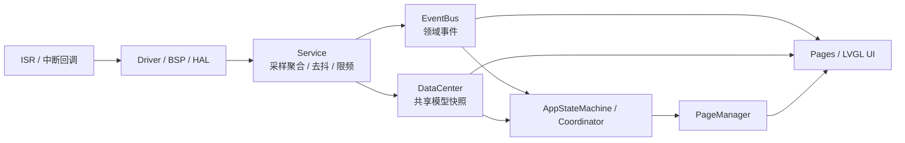

# Hardware Boundary Contract

日期：2026-06-03

本文档只定义未来真实硬件接入时的上层职责边界与同步约束，不定义芯片、板卡、RTOS、驱动框架或目录骨架。

## 目标

- 说明未来接入真实硬件时，哪些上层代码应尽量保持不重写。
- 固定 `ISR -> Service -> DataCenter/EventBus -> AppStateMachine/PageManager -> Pages` 的职责边界。
- 约束未来 RTOS 化前必须补齐的队列、线程归属和 snapshot 边界。

## 非目标

- 不绑定具体芯片、板卡、RTOS 或 HAL API。
- 不新增 `sim/**` 之外的硬件代码骨架。
- 不把同步策略提前细化成线程模型实现方案。

## 总体边界

## 分层职责

### ISR

- 只做最小硬件确认、时间戳记录或唤醒下游处理。
- 不直接改 UI。
- 不直接 publish 面向 UI 的事件。
- 不直接写入 `DataCenter`。
- 不持有页面对象、`PageManager`、`AppStateMachine` 或 LVGL 句柄。

### Driver / BSP / HAL

- 负责寄存器访问、外设读写、中断转发和平台最小抽象。
- 可以产出原始样本或硬件状态，但不解释成 UI 语义。
- 不得直接访问页面、`PageManager`、`DataCenter` 的可变内部状态。

### Service

- 是硬件样本进入应用层的唯一正常入口。
- 负责聚合、去抖、限频、容错、阈值判断和必要的快照整理。
- 只有 Service 可以把原始硬件变化翻译成应用模型更新或领域事件。
- Service 写入 `DataCenter` 前应先形成稳定快照；发布事件前应保证 payload 可被上层按值消费。

### DataCenter

- 承载共享模型快照，是页面和协调层读取事实的稳定入口。
- 不暴露可变裸引用。
- 不允许 UI、Controller、Service 共享同一份可变内部状态并跨层直接修改。
- 未来如果接入多线程或 RTOS，`DataCenter` 的读写策略必须先定义 snapshot 边界，再允许跨线程访问。

### EventBus

- 当前仍是同步分发。
- 同步分发只适用于当前模拟器阶段的单线程/受控上下文。
- 接入 RTOS 或真实硬件前，必须先明确：
  - 哪些事件改为队列投递；
  - 哪些事件仍保留同步语义；
  - 发布线程与消费线程分别归属哪里；
  - 事件 payload 是快照、句柄还是复制值；
  - UI 刷新与后台采样之间的同步边界是什么。

### AppStateMachine / Coordinator

- 负责消费模型与事件，做跨域协调、策略判断和冲突收口。
- 可以决定是否切页、开关临时壳层、应用 `PageManager` 操作。
- 不应下沉为硬件驱动层，也不应承担 ISR/采样聚合职责。
- 未来换硬件时，理想情况是它继续消费同样的模型快照和领域事件，而不是重写页面状态流。

### PageManager

- 只负责页面栈、临时页和显示切换执行。
- 不直接访问 Driver / BSP / HAL。
- 不接收 ISR 或硬件原始样本。

### Pages / LVGL UI

- 只消费模型和事件，不访问 Driver / BSP / HAL。
- 不直接读取寄存器、传感器、GPIO 或中断状态。
- 不直接要求 ISR 改控件或触发页面切换。
- 页面局部状态只服务于视图构建和交互，不承担硬件同步职责。

## 未来硬件接入时哪些上层代码不应重写

以下上层资产应尽量保持稳定，只允许小范围适配而不是推倒重来：

- 页面实现与页面间导航语义。
- `PageManager` 的页面栈与临时壳层契约。
- `AppStateMachine` 作为协调层的职责边界。
- `DataCenter` 的共享模型读取方式。
- 基于领域事件驱动的页面刷新路径。

允许变化的应主要集中在：

- Driver / BSP / HAL 的具体实现。
- Service 如何从真实传感器、按键、表冠或电源域生成稳定模型与事件。
- RTOS 化后新增的队列、线程归属和 snapshot 保护策略。

## 同步与线程边界预留

当前项目仍以模拟器为主，因此本轮只固定约束，不提前实现线程模型：

- ISR 不直接改 UI，不直接 publish UI 事件。
- 硬件采样先进入 Service，再由 Service 聚合、去抖、限频后写入 `DataCenter` 或发布事件。
- 高频采样不直接驱动高频同步 UI 刷新。
- Controller 和页面读取的是模型快照或事件 payload，不共享跨层可变裸状态。
- 在定义清楚队列、线程归属和 snapshot 边界之前，不把当前同步 `EventBus` 直接搬到真实硬件线程环境。

## 对后续实现轮次的约束

- 若未来代码改动让 UI 直接访问 Driver / BSP / HAL，应视为边界破坏。
- 若未来代码改动让 ISR 直接写页面状态、直接切页或直接发布 UI 事件，应视为边界破坏。
- 若未来代码改动让 `DataCenter` 暴露可变裸引用，应视为边界破坏。
- 若未来准备引入 RTOS，但尚未补充队列、线程归属和 snapshot 策略，则不得宣称硬件接入边界已收口。
