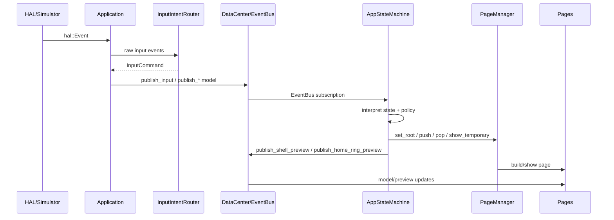

# AppStateMachine State and Event Inventory

日期：2026-05-26

本文档是第 1A 轮产物，只盘点当前 `AppStateMachine` 的状态、事件路径、`PageManager` 调用点和第 1B 轮 `PowerController` 边界输入。本轮不改代码、不拆类、不改变行为。

## Scope Lock

Allowed files:

- `docs/10_architecture/state_machine.md`

Forbidden files:

- `sim/lv_port_pc_vscode/src/App/State/AppStateMachine.h`
- `sim/lv_port_pc_vscode/src/App/State/AppStateMachine.cpp`
- `sim/lv_port_pc_vscode/src/App/UI/PageManager.*`
- `sim/lv_port_pc_vscode/src/App/Input/*`
- `sim/lv_port_pc_vscode/src/App/Common/AppEvents.h`
- 其他所有代码和文档

Forbidden changes:

- 禁止修改代码。
- 禁止提取 `PowerController`。
- 禁止改 `AppStateMachine.h`。
- 禁止改变 `InputIntentRouter`、`PageManager`、现有 `Event` 枚举语义。
- 禁止移动、删除或批量格式化文件。

## Evidence

- `sim/lv_port_pc_vscode/src/App/State/AppStateMachine.h`
- `sim/lv_port_pc_vscode/src/App/State/AppStateMachine.cpp`
- `sim/lv_port_pc_vscode/src/App/Common/AppEvents.h`
- `sim/lv_port_pc_vscode/src/App/Common/DataCenter.h`
- `sim/lv_port_pc_vscode/src/App/Common/DataCenter.cpp`
- `sim/lv_port_pc_vscode/src/App/UI/PageManager.h`

## Current Role

`AppStateMachine` 当前不只是状态机。它同时承担：

- EventBus 订阅入口。
- 输入命令解释。
- 电源状态和 screen-off 策略。
- 长续航模式切换。
- 通知唤醒流程。
- 壳层临时页打开、关闭和预览。
- HomeRing surface 切换和预览。
- `PageManager` 调用协调。
- LVGL timer 创建与释放。

下一阶段目标不是把这些函数物理分散到多个 `.cpp`，而是逐步让 `AppStateMachine` 退回 Coordinator：接收事件，调用领域 Controller，汇总 Action，集中执行 `PageManager` 调用和跨域冲突处理。

## Event Flow Overview



## State Variable Ownership Table

| 状态变量 | 当前用途 | 应归属领域 | 修改者 | 读取者 | 是否应继续留在 AppStateMachine | 并发风险/高频共享 | 未来同步策略 |
|---|---|---|---|---|---|---|---|
| `data_center_` | 读取共享模型、订阅/发布事件 | Coordinator dependency | 构造注入，不应重绑 | 几乎所有处理函数 | 是，作为协调者依赖保留 | 中：未来服务/硬件 task 可能更新模型 | Controller 只读快照或消费事件，不暴露可变引用 |
| `page_manager_` | 统一执行页面栈和临时页操作 | Coordinator dependency | 构造注入，不应重绑 | 导航、电源、壳层、HomeRing 逻辑 | 是，`PageManager` 调用集中在 Coordinator | 低：UI task 内使用 | 保持单线程 UI 边界，Controller 不持有 |
| `navigation_subscription_` | 订阅 `NavigationRequested` | Coordinator/Event binding | 构造函数 | RAII 生命周期 | 是 | 低 | 未来可集中到 StateMachine binding 层 |
| `input_subscription_` | 订阅 `InputRequested` | Coordinator/Event binding | 构造函数 | RAII 生命周期 | 是 | 中：真实输入可能来自 ISR/queue | ISR 不直接发布 UI，输入经队列/Service 后进入 EventBus |
| `notification_wake_subscription_` | 订阅 `NotificationWakeRequested` | NotificationFlow | 构造函数 | RAII 生命周期 | 暂留，后续迁移到 NotificationFlowController binding 或由 Coordinator 分发 | 中：通知队列可能异步变化 | NotificationService 生成事件快照，Controller 不直接读队列 |
| `power_mode_subscription_` | 订阅 `PowerModeChanged` | Power | 构造函数 | RAII 生命周期 | 暂留到 1B，由 Coordinator 转发给 `PowerController` | 中：电源策略可能由设置页/服务触发 | 用事件 payload 快照驱动 |
| `battery_subscription_` | 订阅 `BatteryChanged` | Power/Service boundary | 构造函数 | RAII 生命周期 | 暂留到 1B，由 Coordinator 转发给 `PowerController` | 高：真实电量采样来自硬件/Service | BatteryService 聚合后发布快照，禁止 ISR 直接改 UI |
| `display_policy_subscription_` | 订阅 `DisplayPolicyChanged`，同步自动熄屏/常亮策略 | Power/InputPolicy | 构造函数 | lambda / timer 策略函数 | 暂留到 1B，后续由 PowerController 接收 policy snapshot | 中：设置页和策略 timer 都会影响 | 通过不可变 policy snapshot 和 Action 返回 |
| `power_state_` | `Booting/Running/ScreenOff/PoweredOff` 主电源状态 | Power | `start`、导航、电源、输入、唤醒、页面切换函数 | 几乎所有 guard | 第 1B 应迁移为 PowerController 私有状态，Coordinator 可保留只读镜像或执行结果 | 高：screen state 未来与硬件电源/RTC/唤醒源相关 | PowerAction 携带目标状态和理由，Coordinator 不反向读 mutable state |
| `shell_surface_` | 当前临时壳层类型 | ShellNavigation | `open_shell_surface`、`close_shell_surface`、`sync_shell_surface`、多处 root 切换 | 壳层/导航判断 | 暂留，1C 提取 ShellNavigationController | 低 | 由 ShellNavigationAction 表达打开/关闭/同步 |
| `notification_wake_session_active_` | 通知唤醒后的短会话标志，用于预览关闭后熄屏 | NotificationFlow/Power boundary | 通知唤醒、取消通知熄屏 timer、关闭壳层 | 通知 timer、输入取消、关闭临时页 | 暂留，1C 更适合 NotificationFlowController；PowerController 只处理最终熄屏 Action | 中：通知事件可能异步到达 | NotificationFlow 产生 `RequestScreenOffAfterPreview` 一类 Action |
| `raise_to_wake_session_active_` | 抬腕唤醒会话，决定 dismiss 是否熄屏 | Power/InputPolicy | `SimRaiseToWake`、`clear_raise_session` 调用 | 输入 dismiss、boot/enter screen off | 第 1B 可迁移到 PowerController，因它属于唤醒/熄屏策略 | 中：真实 IMU 可能高频 | IMU Service 降频/去抖后发事件，PowerController 消费 snapshot |
| `suppress_display_policy_sync_` | 长续航/熄屏切换时避免 display policy 回调重入 | Coordinator transition guard | 长续航、熄屏、关机路径 | DisplayPolicyChanged lambda | 暂留 Coordinator，直到明确事件重入策略 | 中：同步 EventBus 下的重入风险 | 后续以 scoped guard 或 Action transaction 表达 |
| `notification_screen_off_timer_` | 通知预览 5s 后熄屏 timer | NotificationFlow/Power boundary | schedule/cancel/callback | 输入、关闭壳层、通知唤醒 | 暂留，优先不进第 1B 的 PowerController，避免通知域被一并拆入 | 中：LVGL timer 属 UI task | NotificationFlow 返回延迟熄屏 Action，timer 生命周期由 Coordinator 或专门 guard 管 |
| `auto_screen_off_timer_` | 自动熄屏 timer 对象 | Power timer ownership | schedule/cancel/callback | 输入活动、屏幕状态切换 | 否。第 1B 只迁移策略状态和判断逻辑，不迁移 `lv_timer_t*` 对象所有权 | 中：LVGL timer 与电源策略耦合 | timer 创建、删除、回调绑定暂留 Coordinator，直到第 2A 生命周期契约或 timer guard 完成 |
| `keep_screen_on_timer_` | 临时保持亮屏 timer 对象 | Power timer ownership | sync/cancel/callback | policy、输入、熄屏路径 | 否。第 1B 只迁移 keep-screen-on 策略状态和判断逻辑，不迁移 `lv_timer_t*` 对象所有权 | 中：policy 与 timer 重入 | timer 创建、删除、回调绑定暂留 Coordinator，PowerAction 携带策略结果 |
| `keep_screen_on_timer_duration_ms_` | 当前 keep-screen 策略周期缓存 | Power policy | sync/cancel/callback | sync 判断 | 第 1B 可迁移为策略状态，但不能连带迁移 `lv_timer_t*` 所有权 | 低 | 私有固定字段，不暴露非 const 引用；Coordinator 仍负责实际 timer 操作 |
| `home_surface_index_` | HomeRing 当前 surface index | HomeRing | start、boot、长续航、唤醒、launch、surface 切换 | HomeRing、壳层预览、返回策略 | 暂留，1C 提取 HomeRingController | 低 | HomeRingController 私有状态，Action 携带目标 index |
| `screen_off_page_state_` | 熄屏前 PageManager 栈快照 | ShellNavigation/Power boundary | enter/wake/long battery/boot | wake、exit long battery | 暂留 Coordinator，不建议第 1B 直接迁移；它是页面栈，不是纯电源状态 | 低到中：UI 栈只能 UI task 访问 | PowerController 返回 `TurnScreenOff`，Coordinator 捕获/恢复 PageManager state |
| `screen_off_home_surface_index_` | 熄屏前 HomeRing index 快照 | HomeRing/ShellNavigation boundary | enter_screen_off | wake_from_screen_off | 暂留，随 HomeRingController 抽取后再处理 | 低 | 熄屏 Action payload 可携带 restore 语义 |
| `notifications_pull_preview_active_` | 顶部下拉通知预览是否进行中 | ShellNavigation/Notifications | input、preview/cancel/open/close | input、preview | 暂留，1C ShellNavigation/NotificationFlow | 低 | Shell preview action 固定 payload |
| `quick_settings_pull_preview_active_` | 底部上拉快捷设置预览是否进行中 | ShellNavigation | input、preview/cancel/open/close | input、preview | 暂留，1C ShellNavigation | 低 | Shell preview action 固定 payload |
| `home_surface_crown_preview_timer_` | 表冠 surface 预览 settle timer | HomeRing | preview/clear/callback | HomeRing preview | 暂留，1C HomeRingController 或 timer helper | 中：LVGL timer 生命周期 | 第 2A 后用 timer guard，避免裸 timer 扩散 |
| `home_surface_crown_preview_active_` | 表冠预览是否 active | HomeRing | preview/finalize/clear | finalize/preview | 暂留，1C HomeRingController | 低 | HomeRingController 私有 |
| `home_surface_crown_preview_direction_` | 表冠预览方向 | HomeRing | preview/finalize/clear | preview/finalize | 暂留，1C HomeRingController | 低 | 固定大小字段 |
| `home_surface_crown_preview_progress_` | 表冠预览进度 | HomeRing | preview/finalize/clear | publish preview | 暂留，1C HomeRingController | 低到中：输入高频时变化 | 输入降频/聚合后产生固定 payload |
| `kHomeSurfaceCount` | HomeRing surface 数量常量 | HomeRing | 编译期常量 | HomeRing 逻辑 | 1C 迁移 | 无 | 编译期常量 |
| `kHomeSurfacePreviewStepPx` | 表冠预览步进常量 | HomeRing | 编译期常量 | HomeRing preview | 1C 迁移 | 无 | 编译期常量 |
| `kHomeSurfacePreviewCommitPx` | 表冠提交阈值 | HomeRing | 编译期常量 | HomeRing preview | 1C 迁移 | 无 | 编译期常量 |
| `kHomeSurfacePreviewSettleMs` | 表冠预览 settle 时间 | HomeRing | 编译期常量 | LVGL timer | 1C 或第 2A 后迁移 | 低 | timer guard |

## EventBus Handling Path Table

| 事件 | 当前处理路径 | 影响状态 | 是否触发导航 | 是否调用 PageManager | 目标归属 |
|---|---|---|---|---|---|
| `NavigationRequested` | 构造订阅 -> `handle_event` -> `handle_navigation` | `power_state_`、`shell_surface_`、可能重置 HomeRing/ScreenOff 快照 | 是 | 是：`set_root`、`push`、`pop`、临时页操作 | Coordinator + ShellNavigation |
| `InputRequested` | 构造订阅 -> `handle_event` -> `handle_input` | 电源状态、抬腕会话、壳层预览、HomeRing 预览、timer | 是 | 是：`set_root`、`push`、`pop`、`show_temporary`、查询临时页/栈 | InputPolicy + Power + ShellNavigation + HomeRing |
| `NotificationWakeRequested` | 构造订阅 -> `handle_event` -> `handle_notification_wake_request` | `notification_wake_session_active_`，可能间接唤醒屏幕和打开预览 | 是 | 是：通过 `wake_from_screen_off` 和 `open_shell_surface` | NotificationFlow + Power |
| `PowerModeChanged` | 构造订阅 lambda -> `handle_power_mode` | 长续航模式下 root、`power_state_`、timer、screen-off 快照 | 是 | 是：`set_root`、`stack_top_page_id` | Power |
| `BatteryChanged` | 构造订阅 lambda -> `handle_battery_changed` | 充电/外接电源时可关闭长续航模式 | 间接，触发 `PowerModeChanged` 后导航 | 当前函数不直接调用，但会写 `DataCenter` | Power + BatteryService boundary |
| `DisplayPolicyChanged` | 构造订阅 lambda -> `sync_keep_screen_on_policy` + `schedule_auto_screen_off` | auto screen off timer、keep screen timer、policy guard | 否，timer 回调后可能熄屏 | 当前 lambda 不直接调用，timer 后会调用 `enter_screen_off` | Power/InputPolicy |
| `ShellPreviewRequested` | 当前由 `AppStateMachine` 发布，页面消费 | 不改状态；用于通知/快捷设置预览 UI | 否 | 否 | ShellNavigation 输出事件 |
| `HomeRingPreviewChanged` | 当前由 `AppStateMachine` 发布，HomeRing 页面消费 | 不改状态；用于 HomeRing preview UI | 否 | 否 | HomeRing 输出事件 |

## PageManager Call Point Table

| 位置 | 调用类型 | 当前目的 | 领域判断 | 后续约束 |
|---|---|---|---|---|
| `start` | `set_root(HomeRingHost)` | 启动进入默认主页 | Coordinator boot | 保留集中调用 |
| `handle_navigation` | `set_root` / `push` / `pop` / `temporary_page_id` | 处理页面命令和壳层命令 | Coordinator + ShellNavigation | 子 Controller 只能返回 NavigationAction，不直接拿 `PageManager` |
| `handle_input` | `set_root(LongBatteryWatchface)`、`pop`、`temporary_page_id`、间接 open/close shell | 输入触发电源/壳层/HomeRing/返回 | 应拆成 InputPolicy 分发到各领域 | 第 1B 不全拆，只迁移电源策略 |
| `boot_to_home` | `set_root(HomeRingHost)` | 返回运行态主页 | Coordinator application of action | 保留或由 Action 执行函数调用 |
| `enter_long_battery_mode` | `set_root(LongBatteryWatchface)` | 进入长续航表盘 | Power policy + navigation execution | PowerController 返回 Action，Coordinator 调 `PageManager` |
| `exit_long_battery_mode` | `stack_top_page_id` | 判断是否从长续航页退出 | Power + Navigation | 查询仍在 Coordinator，避免 Controller 读页面栈 |
| `wake_from_screen_off` | `set_root(LongBatteryWatchface)`、`restore_state_preserving_target` | 从熄屏恢复页面状态 | Power action + navigation restore | PowerController 不直接保存 `PageManager::State` |
| `enter_screen_off` | `capture_state`、`set_root_preserving_current(ScreenOff)` | 保存页面栈并显示熄屏页 | Power action + navigation snapshot | Coordinator 捕获/恢复页面栈 |
| `enter_powered_off` | `set_root(PoweredOff)` | 关机页 | Power action execution | 保留集中调用 |
| `open_shell_surface` | `temporary_page_id`、`show_temporary` | 打开通知/快捷设置/电源菜单/通知预览 | ShellNavigation | 第 1C 迁移策略，执行仍集中 |
| `close_shell_surface` | `temporary_page_id`、`dismiss_temporary` | 关闭临时壳层 | ShellNavigation + NotificationFlow | 第 1C 迁移策略 |
| `preview_notifications_pull` | `stack_top_page_id`、`temporary_page_id`、`show_temporary` | 下拉通知预览 | ShellNavigation + Notifications | 第 1C 迁移 |
| `preview_quick_settings_pull` | `stack_top_page_id`、`temporary_page_id`、`show_temporary` | 上拉快捷设置预览 | ShellNavigation | 第 1C 迁移 |
| `launch_app` | `temporary_page_id`、`stack_top_page_id`、`set_root`、`push` | 从 Launcher 或 Home 启动 app | ShellNavigation/App launch | 保持执行集中 |
| `is_current_home_surface` | `temporary_page_id`、`stack_depth`、`stack_top_page_id` | 判断 HomeRing 是否为当前上下文 | HomeRing + ShellNavigation | 后续用 Coordinator snapshot 输入给 HomeRingController |
| `is_watchface_shell_preview_context` | `stack_top_page_id`、`stack_depth` | 判断壳层预览是否可触发 | ShellNavigation | 后续收进 ShellNavigationController |
| `can_navigate_back` | `temporary_page_id`、`stack_depth` | 返回可行性判断 | ShellNavigation | 后续迁移策略，执行集中 |
| `sync_shell_surface` | `temporary_page_id` | 从当前临时页同步 `shell_surface_` | ShellNavigation | 后续迁移 |
| `handle_notification_wake_request` | `temporary_page_id`、间接 open/wake | 通知唤醒预览或 toast | NotificationFlow + Power | 第 1C 迁移策略，Power 只返回唤醒动作 |

## PowerController Candidate Migration States

第 1B 优先迁移“纯电源策略状态”，不要把页面栈、通知流程和 HomeRing 状态一并拖进去。

应优先迁移到 `PowerController` 私有成员：

- `power_state_`
- `raise_to_wake_session_active_`
- auto-screen-off 的策略状态和判断结果，不包括 `auto_screen_off_timer_` 的 `lv_timer_t*` 所有权
- keep-screen-on 的策略状态和判断结果，不包括 `keep_screen_on_timer_` 的 `lv_timer_t*` 所有权
- `keep_screen_on_timer_duration_ms_` 这类固定大小的策略缓存字段

可由 `PowerController` 读取输入快照或事件 payload，但不应持有：

- `PageManager&`
- `DataCenter&` 的可变访问
- LVGL 页面对象
- `lv_timer_t*` 对象所有权
- 通知队列或页面内部状态

第 1B 的硬边界：`PowerController` 可以判断是否应该启动、重置、停止 auto-screen-off / keep-screen-on 计时，但 `lv_timer_t*` 的创建、删除、回调绑定暂时仍留在 `AppStateMachine` / Coordinator。timer 对象所有权等第 2A 轮 UI 生命周期契约或 timer guard 完成后再处理。

暂不建议第 1B 迁移：

- `screen_off_page_state_`：这是页面栈快照，应由 Coordinator 在执行 `TurnScreenOff` / `WakeScreen` Action 时捕获和恢复。
- `screen_off_home_surface_index_`：属于 HomeRing restore 信息，等 HomeRingController 拆分时再定。
- `notification_screen_off_timer_`：属于通知唤醒流程的延迟熄屏，容易把 NotificationFlow 也拖入 1B。
- `notification_wake_session_active_`：属于通知流程与电源边界，第 1B 可通过 Action reason 处理，但不宜作为首批私有状态。
- `suppress_display_policy_sync_`：当前是同步 EventBus 下的重入 guard，留在 Coordinator 更稳。

## PowerController Candidate Migration Functions

第 1B 可以围绕下列函数或函数片段提取边界，但每次迁移都必须保持外部行为不变：

- `handle_power_mode(const PowerModeModel&)`
- `handle_battery_changed(const BatteryModel&)`
- `enter_long_battery_mode(PageTransition)`
- `exit_long_battery_mode(PageTransition)`
- `wake_from_screen_off(PageTransition)`
- `enter_screen_off()`
- `enter_powered_off()`
- `schedule_auto_screen_off()`
- `cancel_auto_screen_off()`
- `reset_auto_screen_off_timer()`
- `sync_keep_screen_on_policy()`
- `cancel_keep_screen_on_timer(bool)`
- `keep_screen_on_active() const`
- `long_battery_mode_enabled() const`

第 1B 只应迁移 `handle_input` 中与电源直接相关的片段：

- `DebugToggleScreenOff`
- `SimRaiseToWake`
- `SimRaiseDismiss`
- `SimCoverSleep`
- `CrownPress` 在 `ScreenOff` 下唤醒的分支
- `TouchActivity` 在 `ScreenOff` 下唤醒的分支
- 输入活动重置 auto-screen-off timer 的逻辑

第 1B 不应迁移：

- `auto_screen_off_timer_cb(lv_timer_t*)`
- `keep_screen_on_timer_cb(lv_timer_t*)`
- `lv_timer_create`
- `lv_timer_del`
- `lv_timer_set_repeat_count`
- `lv_timer_set_period`
- `lv_timer_reset`

这些属于 LVGL timer 对象生命周期和回调绑定，暂时留在 Coordinator。

第 1B 不应迁移 `handle_input` 中的壳层预览、HomeRing 切换、Launcher 打开、返回栈处理。

## States Temporarily Staying in AppStateMachine

| 状态 | 暂留原因 |
|---|---|
| `data_center_` | Coordinator 需要作为事件订阅和模型快照入口。 |
| `page_manager_` | `PageManager` 调用必须集中，Controller 不直接操作 UI。 |
| 所有 `EventBus::Subscription` | 第 1B 前仍由 AppStateMachine 统一绑定事件。 |
| `shell_surface_` | 属于壳层导航，等 ShellNavigationController 轮次拆。 |
| `screen_off_page_state_` | 页面栈快照，不能直接塞进 PowerController。 |
| `screen_off_home_surface_index_` | HomeRing restore 信息，等 HomeRingController 轮次拆。 |
| `notification_wake_session_active_` | 通知流程状态，等 NotificationFlowController 轮次拆。 |
| `notification_screen_off_timer_` | 通知预览自动熄屏 timer，等 NotificationFlow 或 UI timer guard 方案明确。 |
| `notifications_pull_preview_active_` | 通知壳层预览状态，等 ShellNavigation/NotificationFlow 拆。 |
| `quick_settings_pull_preview_active_` | 快捷设置壳层预览状态，等 ShellNavigation 拆。 |
| HomeRing preview 相关字段 | 等 HomeRingController 拆。 |
| `suppress_display_policy_sync_` | 同步事件重入 guard，先留 Coordinator。 |

## States To Move Next Round

第 1B 的最小迁移目标：

1. `power_state_`
2. `raise_to_wake_session_active_`
3. auto-screen-off 策略状态和判断逻辑，不包含 `lv_timer_t*` 所有权
4. keep-screen-on 策略状态和判断逻辑，不包含 `lv_timer_t*` 所有权

建议第 1B 新类型约束：

```cpp
enum class PowerActionType : uint8_t {
    None,
    WakeScreen,
    TurnScreenOff,
    EnterLowPowerMode,
    ExitLowPowerMode,
    ShowPowerMenu,
};

enum class PowerActionReason : uint8_t {
    UserInput,
    Timeout,
    BatteryLow,
    UserRequest,
    NotificationWake,
};

struct PowerAction {
    PowerActionType type{PowerActionType::None};
    PowerActionReason reason{PowerActionReason::UserInput};
    int8_t target_brightness_percent{-1};
    int32_t next_wakeup_ms{-1};
    bool pause_background_polling{false};
    bool restore_previous_page{false};
};
```

`PowerAction` 必须固定大小、按值传递、无动态资源；不得使用 `std::string`、`std::vector`、heap allocation 或复杂对象所有权。

## Concurrency And High-Frequency Risk Notes

第 1A 只标注风险，不实现 mutex、queue 或锁。

高风险输入/模型：

- `BatteryModel`: 未来来自硬件采样，应由 BatteryPowerService 聚合后发布快照。
- `MotionModel`: 抬腕唤醒来源可能高频，不应直接同步驱动 UI。
- `InputCommand`: 真实触摸、表冠、按键可能来自 ISR 或 RTOS task，必须先归一化。
- `NotificationCenterModel`: 通知队列可能异步更新，Controller 不应共享可变队列。
- `DisplayPolicyModel`: 设置页修改和 timer 策略可能重入，需 Action 或 transaction 边界。
- `power_state_`: 未来可能对应屏幕、电源域、RTC 唤醒源，不应裸共享。
- LVGL timers: 当前 timer callback 直接回到 `AppStateMachine`，第 2A 前不要复制 timer 模式。

预留原则：

- ISR 不直接改 UI。
- 硬件采样通过队列或 Service 进入应用层。
- `DataCenter` 不暴露可变裸引用。
- 高频数据不直接触发大量同步 UI 更新。
- Controller 读取快照或消费事件，不共享可变状态。
- `Driver/BSP/HAL` 与 `UI/StateMachine` 之间必须有事件队列、快照或同步边界。

## Code Contract For Later Rounds

- 状态边界最终必须由 C++ 类型和访问控制强制，而不是只靠 Markdown。
- 不新增 public mutable state。
- 不暴露非 const 可变引用。
- 不优先使用 `friend` 作为解耦手段。
- 状态应逐步移动到拥有它的 Controller 私有成员中。
- Controller 对外只暴露窄接口、const 查询和 Action 返回值。
- `AppStateMachine` 不应为了执行 Action 再反向读取 Controller 内部 mutable state。
- Controller 不得直接调用 `PageManager`。
- Controller 不得创建 LVGL 对象。
- Controller 不得访问页面内部。

## 1B Boundary Recommendation

第 1B 不应追求“所有电源相关代码一次迁移干净”。建议闭环是：

1. 新增 `PowerController` 和固定大小 `PowerAction` 类型。
2. 先让 `PowerController` 接管 `power_state_`、抬腕会话和自动熄屏/常亮策略判断。
3. `AppStateMachine` 仍集中执行 `PageManager` 调用、页面栈保存/恢复、LVGL 页面切换和 `lv_timer_t*` 对象所有权。
4. `PowerController` 只返回 Action，Action 必须携带执行所需 payload。
5. 行为回归重点看：启动进 HomeRing、手动熄屏/唤醒、自动熄屏、keep-screen-on、长续航进入/退出、关机页、通知唤醒。
