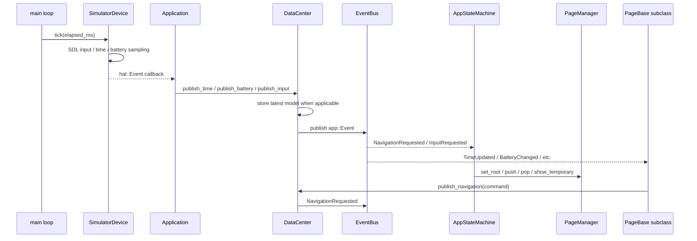
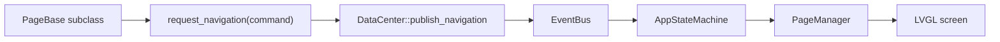

# Current Simulator Architecture

本文件记录 `sim/lv_port_pc_vscode` 当前模拟器架构骨架。它不是最终架构蓝图，而是第一版“现状地图”：先看清已有代码如何运行，再决定后续如何提炼、拆分或迁移。

## Reading Scope

本次阅读重点：

- `sim/lv_port_pc_vscode/src/main.cpp`
- `sim/lv_port_pc_vscode/src/App/Application.h`
- `sim/lv_port_pc_vscode/src/App/Application.cpp`
- `sim/lv_port_pc_vscode/src/App/Common/DataCenter.h`
- `sim/lv_port_pc_vscode/src/App/Common/DataCenter.cpp`
- `sim/lv_port_pc_vscode/src/App/Common/EventBus.h`
- `sim/lv_port_pc_vscode/src/App/Common/EventBus.cpp`
- `sim/lv_port_pc_vscode/src/App/Common/AppEvents.h`
- `sim/lv_port_pc_vscode/src/App/UI/PageBase.h`
- `sim/lv_port_pc_vscode/src/App/UI/PageManager.h`
- `sim/lv_port_pc_vscode/src/App/UI/PageManager.cpp`
- `sim/lv_port_pc_vscode/src/App/State/AppStateMachine.h`
- `sim/lv_port_pc_vscode/src/App/State/AppStateMachine.cpp`
- `sim/lv_port_pc_vscode/src/HAL/HAL.h`
- `sim/lv_port_pc_vscode/src/HAL/HAL.cpp`
- `sim/lv_port_pc_vscode/src/Platform/Simulator/SimulatorDevice.h`
- `sim/lv_port_pc_vscode/src/Platform/Simulator/SimulatorDevice.cpp`

## Runtime Ownership

```mermaid
flowchart TD
    Main["main.cpp / SDL_main"]
    LVGL["LVGL runtime"]
    DeviceFactory["hal::create_simulator_device()"]
    Device["hal::Device interface"]
    SimulatorDevice["platform::simulator::SimulatorDevice"]
    Application["app::Application"]
    DataCenter["app::DataCenter"]
    EventBus["app::EventBus"]
    PageManager["app::PageManager"]
    AppStateMachine["app::AppStateMachine"]
    Pages["PageBase subclasses"]

    Main --> LVGL
    Main --> DeviceFactory
    DeviceFactory --> SimulatorDevice
    SimulatorDevice -. implements .-> Device
    Main --> Application
    Application o-- Device
    Application o-- DataCenter
    Application o-- PageManager
    Application o-- AppStateMachine
    DataCenter o-- EventBus
    PageManager o-- Pages
    AppStateMachine --> DataCenter
    AppStateMachine --> PageManager
    Pages --> DataCenter
```

当前组合根是 `Application`：它持有 `Device`、`DataCenter`、`PageManager`、`AppStateMachine`。`main.cpp` 只负责初始化 LVGL、创建模拟器设备、启动应用，并在主循环里驱动 `application.tick()` 和 `lv_timer_handler()`。

## Event Flow



核心链路是：

1. `SimulatorDevice` 把 SDL 键盘、鼠标、时间、电池模拟转换成 `hal::Event`。
2. `Application::handle_hal_event()` 把 `hal::Event` 翻译成应用层模型或命令。
3. `DataCenter` 保存最近的 `TimeModel`、`BatteryModel`、`MotionModel`，并通过 `EventBus` 发布事件。
4. `AppStateMachine` 订阅导航和输入事件，决定电源态、系统壳层、页面跳转。
5. 页面订阅数据模型事件来刷新 UI，也可以通过 `request_navigation()` 发出导航意图。

## Module Roles

### Application

`Application` 是当前模拟器的应用组合根和事件翻译层。

职责：

- 注册所有页面工厂。
- 设置 HAL 事件回调。
- 启动 `AppStateMachine`。
- 在 `tick()` 中驱动设备采样。
- 将 HAL 层事件翻译为 App 层事件或模型。

边界判断：这个层目前承担“接线”和“翻译”职责，方向是合理的。后续如果服务增多，应避免继续把所有业务翻译都塞进 `Application`，可以逐步提炼 `Service` 层。

### Platform / HAL

`HAL.h` 定义 `hal::Device` 抽象和 HAL 事件类型。`SimulatorDevice` 是当前 PC 模拟器实现，内部处理 LVGL SDL window、鼠标、键盘、模拟时间、电池变化。

职责：

- 隔离模拟器设备创建。
- 把平台输入转换为硬件语义事件。
- 提供统一 `initialize()`、`set_event_callback()`、`tick()` 接口。

边界判断：平台抽象已经有雏形，但当前 `SimulatorDevice` 同时负责 LVGL SDL 初始化、输入手势识别、时间/电池模拟。后续移植真实硬件时，需要把“设备驱动”和“模拟数据源”继续拆清楚。

### DataCenter

`DataCenter` 是当前应用数据中心和事件发布入口。

职责：

- 保存最近一次时间、电池、运动模型。
- 发布模型更新事件。
- 发布导航和输入命令。
- 对外提供 `subscribe()`，隐藏内部 `EventBus`。

边界判断：它已经体现“UI 不直接碰硬件”的方向。当前它还比较轻，未来要警惕把所有业务状态都堆成一个大对象；可以按领域逐步形成 `TimeService`、`BatteryService`、`SensorService` 等服务，再由数据模型向 UI 暴露。

### EventBus

`EventBus` 是同步发布订阅机制。

职责：

- 按 `EventId` 管理订阅者。
- 使用 RAII `Subscription` 自动取消订阅。
- 发布事件时复制当前 handler 列表，降低发布过程中订阅表被修改的风险。

边界判断：当前是单线程、同步、立即分发模型，适合模拟器 v0。以后上 RTOS 或多服务并发时，要重新评估事件队列、线程归属和跨任务同步。

### PageManager

`PageManager` 管理页面生命周期和导航栈。

职责：

- 注册 `PageId -> Page factory`。
- 懒加载并缓存页面实例。
- 管理主页面栈、临时页面、当前可见页面。
- 负责 LVGL screen load animation。

边界判断：页面栈属于 `PageManager`，状态机只发出导航动作，这是好的。当前页面实例被缓存，订阅一般也会长期保留；这对模拟器简单有效，但未来若页面很多，需要设计页面销毁、资源释放和订阅生命周期策略。

### AppStateMachine

`AppStateMachine` 是系统行为的核心协调者。

职责：

- 维护 `PowerState`: `Booting`、`Running`、`ScreenOff`、`PoweredOff`。
- 维护 `ShellSurface`: launcher、quick settings、power menu 等临时系统界面。
- 消费 `NavigationRequested` 和 `InputRequested`。
- 将输入手势和导航命令转换为 `PageManager` 操作。

边界判断：它已经承担“手表系统状态”的骨架角色，是后续自顶向下设计最值得保护的模块。当前 `EdgeBackOverlay` 放在状态机 cpp 内，带有少量 UI 表现逻辑；v0 可以接受，但后续如果手势反馈复杂，应迁到 UI/shell 层。

## Page / Navigation Flow



页面不直接调用 `PageManager`，而是通过 `DataCenter` 发布 `NavigationCommand`。这让页面表达“我要返回、打开某页面、打开系统面板”这种意图，而不是直接改全局导航状态。

当前典型命令：

- `Push`: 普通页面入栈。
- `Pop`: 返回上一页。
- `ReturnHome`: 回到表盘。
- `OpenLauncher`: 打开 launcher 临时界面。
- `OpenQuickSettings`: 打开快捷设置临时界面。
- `OpenPowerMenu`: 打开电源菜单。
- `PowerOff` / `Restart`: 电源状态切换。

## Current Strengths

- 已经不是简单轮询页面逻辑，而是有事件驱动主线。
- `Application`、`DataCenter`、`PageManager`、`AppStateMachine` 的职责大体可分。
- 页面通过数据模型和事件更新 UI，没有直接访问 HAL。
- `HAL::Device` 让模拟器和未来硬件之间有替换点。
- 状态机已经覆盖 screen off、powered off、launcher、quick settings、power menu 等手表系统级行为。

## Risks And Gaps

- `Service` 层还没有独立出现；时间、电池、输入翻译目前主要集中在 `Application` 和 `SimulatorDevice`。
- `EventBus` 是同步调用，不是异步队列；未来上 RTOS 时不能直接假设它能跨任务安全使用。
- `DataCenter` 未来可能膨胀，需要尽早按领域状态拆分规则。
- `PageManager` 缓存页面，页面订阅也长期存在；未来需要资源生命周期策略。
- `AppStateMachine` 内部有 `EdgeBackOverlay` UI 反馈代码，后续应观察是否破坏状态机纯度。
- `SimulatorDevice` 把 SDL/LVGL 初始化、手势识别、模拟传感数据混在一个实现里，后续硬件抽象还需要继续变薄。

## First Conclusion

当前模拟器已经具备 Magic Watch v0 所需要的轻量事件驱动骨架：

```text
Platform/HAL -> Application -> DataCenter/EventBus -> AppStateMachine -> PageManager -> Page/UI
                                      \---------------------------------------> Page/UI data refresh
```

因此下一步不应该推倒重写，而应该围绕这条主线做“小步提炼”：

1. 先把现有骨架讲清楚、画清楚。
2. 再定义第一批服务边界，例如时间、电池、输入、系统电源。
3. 每次只移动一个职责，保持模拟器可运行。
4. 只有当轻量事件模型无法表达复杂行为时，再讨论是否引入更完整的 QPC/主动对象机制。
