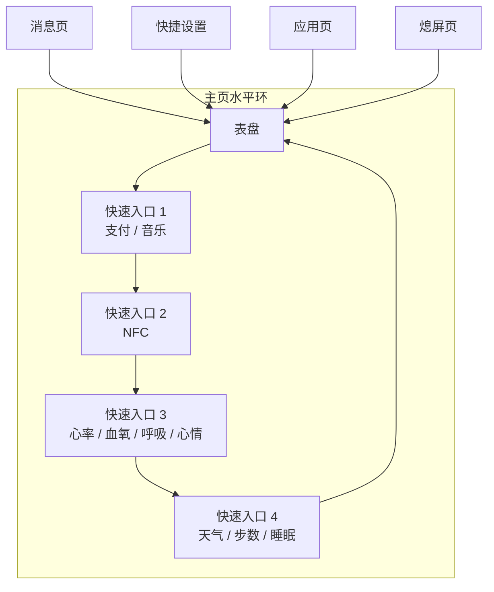

# Home Interaction Model

本文件定义以表盘为中心的主交互模型。它描述的是“用户如何理解这只表”，而不是具体某个 cpp 文件怎么写。

## Product Intent

主界面不是一个孤立表盘，而是一个以表盘为中心的交互十字：

- 左右：快速入口环。
- 上方：消息页。
- 下方：快捷设置。
- 按压表冠：应用页。
- 熄屏态按压表冠：亮屏回到表盘。
- 熄屏由超时、翻腕后的姿态判断、遮盖熄屏等显示策略触发。

这个模型比“把所有内容都做成普通页面栈”更符合手表使用习惯，也更适合后续引入表冠、低功耗和唤醒态设计。

## Spatial Map

这里最关键的不是页面数量，而是“主页水平环”这个概念。表盘和 4 个快速入口是同一层级的主页表面，不应简单视为普通 push/pop 页面。

## Home Surface Types

### 1. Watchface Surface

职责：

- 显示时间、电池、少量状态信息。
- 承接视觉风格和部分动态效果。
- 作为用户心理上的“原点”。

行为：

- 左右滑进入快速入口环。
- 左边缘右滑在主页环中仍属于主页流转，不表示“返回上一页”。
- 上方下滑进入消息页。
- 下方上滑进入快捷设置。
- 表冠按下进入应用页。
- 表冠旋转可调节表盘局部动画效果。

### 2. Quick Entry Surfaces

职责：

- 显示高频快捷应用或关键数据。
- 支持卡片化、信息密度较高的浏览。
- 与表盘构成循环主页环。

建议首批 4 页：

- 快速入口 1：微信支付、支付宝支付、音乐控制。
- 快速入口 2：NFC。
- 快速入口 3：心率、血氧、呼吸训练、心情。
- 快速入口 4：天气、步数、睡眠。

行为：

- 左右滑切换到相邻主页表面。
- 从最后一个入口继续滑动回表盘。
- 表冠旋转可在主页表面之间顺序切换。
- 左边缘右滑仍按主页环规则切换，不走通用返回。

## Shell Surfaces

### 消息页

- 从表盘顶部下滑进入。
- 当前阶段仅显示 mock 通知列表或“暂无消息”。
- 未来再接入手机同步。
- 左边缘右滑返回表盘。
- 若消息内容超出一屏，支持流式上下滚动。

### 快捷设置

- 从表盘底部上滑进入。
- 展示若干高频开关。
- 长按某设置项进入详细设置页。
- 左边缘右滑返回表盘或上级设置页。
- 在设置详情等列表型内容中，支持上下滚动。

### 应用页

- 表冠按下从表盘进入。
- 首先服务于“系统入口总览”，不急于追求最终应用布局。
- 可先从简单网格或列表开始。
- 左边缘右滑返回表盘。
- 若使用列表或纵向应用容器，支持上下滚动。

### 电源菜单

- 当前阶段仅保留为系统壳层预研入口，不绑定最终硬件输入。
- 提供关机、重启等系统级动作。
- 左边缘右滑返回上级页面。

### 熄屏页

- 由超时熄屏、翻腕后的姿态熄屏、遮盖熄屏等策略触发。
- 熄屏态下按压表冠亮屏并回到表盘。
- 熄屏页不是简单黑屏，它代表显示策略和唤醒策略开始接管交互。

## Edge Back Gesture Semantics

同一个“屏幕左边缘右滑”手势，在手表里不能只有一种语义。

建议明确分成两类：

- 在表盘和左右 4 个快速入口构成的主页环里：它是主页表面流转手势。
- 在应用页、消息页、快捷设置页、设置详情页和其他普通页面里：它是返回上级页面的手势。

这条规则的意义是：

- 用户在主页环中感受到的是“横向浏览”。
- 用户在非主页页面中感受到的是“层级返回”。

这样同一个边缘手势既保留效率，也不会把主页环误判成普通页面栈。

## Scroll Interaction Physics

在消息页、设置页、应用页等流式页面中，滚动不能只是“能动”，还要有正确的物理感。

### Touch Scroll

建议后续实现遵循这几条：

- 手指按住拖动时，内容应尽可能跟手。
- 慢速拖动时，内容位移应主要由手指直接控制。
- 快速滑动并松手后，内容应保留一段速度继续滚动。
- 惯性滚动需要逐步减速，而不是突然停止。

这套规则对应的其实是“直接操控感”：

- 手指还在屏幕上时，用户拖的是内容本身。
- 手指离开后，系统接管速度衰减和缓冲。

### Crown Scroll

在可滚动页面中，表冠旋转不应成为完全不同的一套浏览系统。

建议：

- 表冠旋转和触摸滚动作用于同一滚动上下文。
- 两者保持一致的内容方向。
- 表冠更偏向可控、稳定的连续步进。
- 未来如果加入表冠加速，也应保持视觉反馈平滑，而不是突兀跳跃。

### Visual Priority

这部分体验优先级很高，因为它直接影响用户对系统“顺不顺”的感受。

宁可当前阶段少做几个真实功能，也不要让列表、消息、设置这些高频页面只有生硬的位移，没有跟手、惯性和缓冲。

## Display Wake Policy

显示开关不是一个孤立动作，而是一组“谁能唤醒屏幕、什么时候熄屏、熄屏后保留什么”的策略组合。

### Wake Sources

熄屏状态下，建议先定义 3 类可配置亮屏来源：

- `CrownPressWake`: 按下表冠亮屏。
- `RaiseToWake`: 翻腕亮屏。
- `TapToWake`: 单击屏幕亮屏，默认关闭。

其中：

- `RaiseToWake` 支持关闭、全天开启、按时间段开启。
- `TapToWake` 当前只定义产品语义，不假设所有硬件都能低功耗实现。

### Auto Screen Off

建议支持以下熄屏策略：

- `TimeoutOff`: 超时熄屏，默认 5 秒，可配置。
- `PoseOff`: 翻腕亮屏后，依据姿态变化自动熄屏。
- `CoverOff`: 遮盖整个表盘时熄屏。
- `AlwaysOnDisplay`: 持续亮屏，熄屏态显示静态低功耗表盘。

### Important Hardware Boundary

这里需要很诚实地写清楚一件事：

- `TapToWake` 是否可行，取决于触控控制器是否支持低功耗唤醒扫描。
- `RaiseToWake` 的功耗表现，取决于 IMU、唤醒中断、采样策略和主控睡眠架构。
- `AlwaysOnDisplay` 的真实收益，取决于屏幕类型、刷新方式和显示驱动能力。

所以当前阶段我们先定义：

- 交互策略。
- 配置项。
- 状态切换规则。

而不把真实功耗指标当作已经解决的问题。

## Crown Behavior

表冠输入必须是上下文敏感的，不能在所有页面都做成同一种语义。

### Crown Press

- 在熄屏态：亮屏并回到表盘。
- 在表盘或主页环中：进入应用页。
- 在其他页面：回到表盘。
- 长按表冠：当前阶段预留，不绑定最终功能。

当前倾向：

- 不直接拿长按表冠做关机入口。
- 未来再讨论是否绑定语音助手、快捷动作或系统入口。

### Crown Rotate

- 在主页环中：切换表盘与快速入口页。
- 在表盘上：允许绑定局部视觉反馈或轻量动画参数。
- 在可滚动列表页中：等价于竖向遍历列表。
- 在未来复杂页面中：需要由页面声明是否消费旋转输入。

## Gesture Priority

建议后续实现时遵守以下优先级：

1. 先判断当前是否处于主页环。
2. 如果处于主页环，左边缘右滑进入主页流转分支。
3. 如果不处于主页环，左边缘右滑进入通用返回分支。
4. 只有在页面显式声明自定义消费时，才覆盖默认行为。

## One Important Boundary

主页水平环不是“4 个真正业务模块已经完成”的证明。

在当前阶段，这些页面更适合被定义为：

- 交互模板。
- 布局模板。
- mock 数据模板。

而不是完整的支付页、健康页、天气页、音乐页。

这条边界很重要，因为它直接决定我们是在训练系统设计，还是又回到了“先堆一堆功能再说”。

## Recommended State Split

为了后续实现，建议先把主交互拆成 4 类状态：

- `PowerState`: Running / ScreenOff / PoweredOff
- `HomeSurfaceState`: Watchface / Shortcut1 / Shortcut2 / Shortcut3 / Shortcut4
- `ShellState`: None / Notifications / QuickSettings / Launcher / PowerMenu
- `ContentPageState`: SettingsDetail / AppPage / GenericPageStack
- `DisplayWakePolicyState`: WakeSources / Timeout / PoseOff / CoverOff / AlwaysOn

这样做的好处是：

- 主页环不和普通页面栈混成一团。
- 表冠和触控行为可以按状态归属解释。
- 边缘返回手势可以按上下文拥有不同语义而不冲突。
- 显示开关策略不需要硬塞进页面回调里。
- 未来加低功耗和唤醒态时不会推翻主页模型。
