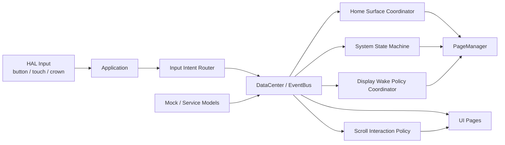

# Target Architecture For v0

本文件描述 Magic Watch `v0` 推荐的目标骨架。它不要求马上重写现有代码，而是给后续每次小改提供方向。

## Design Goal

让当前模拟器从“已经有轻量骨架”进一步演化为“能稳定承载表盘十字交互”的架构。

目标不是引入更多框架，而是把当前已有的：

- `Application`
- `DataCenter`
- `EventBus`
- `PageManager`
- `AppStateMachine`
- `HAL / Platform`

组织成更清晰的职责链。

## Proposed Shape



## Recommended Responsibilities

### Application

保留组合根职责：

- 组装模块。
- 连接 HAL 回调。
- 驱动 tick。

建议减少的职责：

- 不继续堆叠越来越多的业务判断。
- 不负责解释表盘十字交互策略。

### Input Intent Router

这是 v0 最值得补出的新概念，即使一开始它只是 `Application` 内部的一层翻译规则。

职责：

- 将按钮、触摸、表冠原始输入映射成高层意图。
- 输出例如 `HomeSwipeLeft`、`HomeEdgeBackRight`、`NavigateBack`、`OpenNotifications`、`CrownPress`、`CrownLongPress`、`CrownRotateCW`、`RaiseToWakeDetected`、`TapToWakeDetected`、`CoverDetected` 等语义事件。
- 输出例如 `HomeSwipeLeft`、`HomeEdgeBackRight`、`NavigateBack`、`OpenNotifications`、`CrownPress`、`CrownLongPress`、`CrownRotateCW`、`RaiseToWakeDetected`、`TapToWakeDetected`、`CoverDetected`、`ScrollDrag`、`ScrollFlick` 等语义事件。

原因：

- 当前 HAL 层只有 button/touch 语义，未来加入表冠后，直接把所有逻辑塞进状态机会很快变乱。
- 高层输入意图比原始触摸事件更适合做自顶向下设计。
- 同一个左边缘右滑手势在主页环和普通页面中的语义不同，必须在高层意图层分流。

### System State Machine

保留并强化当前 `AppStateMachine` 的系统态职责：

- Running / ScreenOff / PoweredOff
- PowerMenu
- QuickSettings
- Notifications
- Launcher
- 普通页面 push/pop

这里更适合管“系统壳层”和“可否进入某态”，而不是亲自维护主页环索引。
对于左边缘右滑这类通用返回手势，也更适合由它处理“返回谁、能不能返回”。

### Home Surface Coordinator

这是 v0 的第二个关键概念。

职责：

- 管理表盘和 4 个快速入口页。
- 支持左右循环。
- 支持表冠旋转切换。
- 消费主页上下文下的左边缘右滑流转手势。
- 统一维护主页页码指示和当前索引。

理由：

- 主页环不是普通页面栈。
- 它有循环、表冠旋转、视觉指示器、主页原点等专属规则。
- 如果硬塞进普通 push/pop，后续很容易让导航语义混乱。

### Display Wake Policy Coordinator

这是这次新补出的第三个关键概念。

职责：

- 管理亮屏来源开关。
- 管理超时熄屏、姿态熄屏、遮盖熄屏、持续亮屏等策略。
- 在 `Running`、`ScreenOff`、`AlwaysOnDisplay` 等显示相关子态之间协调。
- 把硬件输入事件转换成“是否允许点亮屏幕”的决策。

理由：

- 显示开关策略既不是纯页面逻辑，也不应该散落在输入回调里。
- 这部分未来和低功耗、IMU、触控、显示驱动强相关，单独成块更容易迁移到真实硬件。
- 这样可以在模拟器里先验证策略，再在硬件上替换底层实现。

### Scroll Interaction Policy

这是这次新补出的第四个关键概念。

职责：

- 统一定义流式页面中的拖动、惯性、减速和缓冲规则。
- 约束触摸滚动和表冠滚动的方向一致性。
- 让页面复用同一套“滚动手感”原则，而不是各写各的。

理由：

- 小屏手表上，滚动手感直接决定页面是否可用。
- 触摸滚动如果没有跟手和惯性，会明显破坏产品质感。
- 表冠和触摸若分别实现两套手感，用户会感到割裂。

### PageManager

保留现有职责：

- 页面工厂。
- 页面缓存。
- 页面动画。
- 栈和临时页面显示。

建议：

- `PageManager` 继续做“如何显示页面”。
- 不让它决定“为什么跳这个页面”。

### DataCenter / EventBus

继续作为共享模型和事件分发中心。

v0 新需求下建议增加的模型类型：

- `HomeSurfaceModel`
- `NotificationListModel`
- `QuickSettingsModel`
- `LauncherModel`
- `DisplayPolicyModel`
- `ScrollInteractionModel`

这些都可以先由 mock 数据填充。

## Interface Direction

v0 后续接口建议朝这几个方向演化：

```text
HAL Event -> InputIntent
InputIntent -> StateMachine / HomeCoordinator / DisplayPolicyCoordinator / ScrollInteractionPolicy
Service or MockModel -> DataCenter
DataCenter -> Page update
NavigationIntent -> PageManager
```

这条链路的好处是：

- 输入解释和页面展示分离。
- 主页环与普通页面栈分离。
- 显示唤醒策略与页面交互分离。
- 同一触摸手势可以在不同上下文拥有稳定且可解释的不同语义。
- 流式页面的触摸与表冠滚动可以共享一致的物理反馈规则。
- mock 数据将来可被真实服务替换。

## Suggested First Implementation Steps

1. 为文档层面先确认主页环、消息页、快捷设置、应用页、电源菜单的状态归属。
2. 给输入系统补出“表冠按压/旋转、翻腕亮屏、单击亮屏、遮盖熄屏、拖动滚动、快速滑动”这一层高层意图定义。
3. 定义显示唤醒策略模型，先在模拟器中验证配置和状态切换。
4. 定义滚动物理规则，先在消息页、设置页或应用页验证跟手和惯性体验。
5. 再决定是把主页环做成单独协调器，还是先在 `AppStateMachine` 中临时实现一个清晰子区域。
6. 最后才开始实际页面样机开发。

## Non-Goal For Now

当前不建议马上做这些：

- 把所有快速入口页都连上真实业务。
- 为了主页环而彻底推翻 `PageManager`。
- 一开始就引入完整 HSM / QPC。
- 在硬件未定前承诺真实功耗水平或真实 `TapToWake` 实现。
- 先上 RTOS 任务划分再想清楚交互状态。
